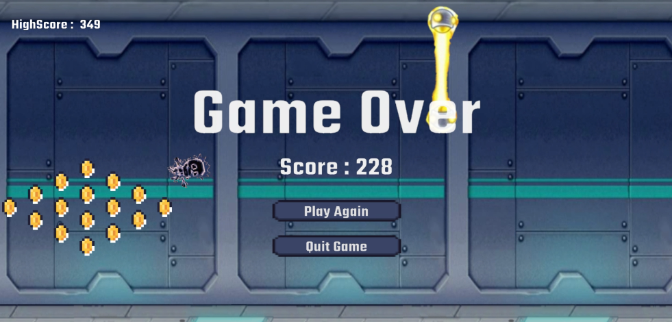

#  Jetpack Joyride Clone

A Jetpack Joyride-style game built in Unity Engine as a follow-up mini project to further develop my understanding of 2D gameplay systems. This project builds on my first mini game by focusing more on particle systems, feedback, and handling multiple gameplay events. The general gameplay loop is fairly similar to Flappy Bird, so the main development aspects I focused on are:
- Expanding on C# gameplay systems with a more event-driven approach.
- Working more deeply with Unity’s Particle System, including physics-based particles.
- Reusing and refining scrolling + spawning systems from my previous project.
- Handling multiple failure conditions (obstacles, lock-on rocket, etc.).
- Added collectable coins as a secondary task to improve gameplay loop.
- Improving overall game feel through audio and sprite animations.

## Gameplay 
Press or Hold Space/Left Click to propel the player upwards, avoid obstacles and collect coins for as long as possible.

Clone and build this project in Unity to Play:
### `https://github.com/SaedulH/Mini-Game-2---Jetpack-Joyride.git`

 

## Challenges
- Making particle effects feel responsive and tied to gameplay events.
- System timing: Moved effects to event-driven triggers for consistency.
- Balancing multiple failure conditions without breaking game flow.
- Spacial framing for non-uniform shaped and randomised obstacles and collectables.
  
## Future Considerations
- Introduce object pooling for particles and obstacles
- Improve difficulty scaling and pacing
- Add more variation in obstacles and hazards
- Refactor systems into cleaner, reusable modules
- Polish UI and transitions further
